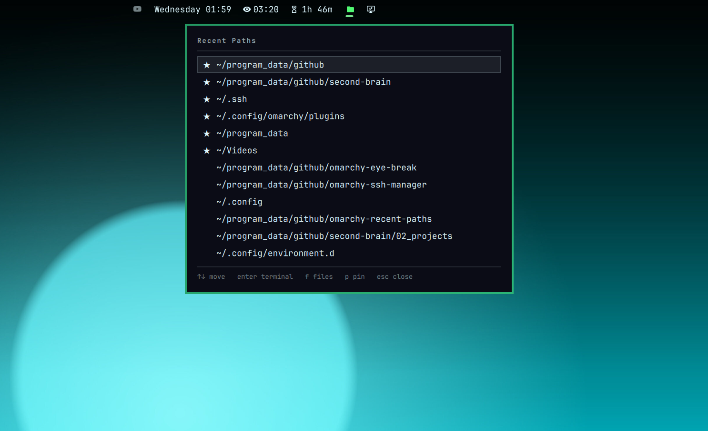

# Omarchy Recent Paths

Reopen a directory you were just in, for [Omarchy](https://omarchy.org).

One glyph in the bar, one list, two keys: `enter` opens the directory in your
terminal, `f` opens it in your file manager. The list is
[zoxide](https://github.com/ajeetdsouza/zoxide)'s, so it is already ranked by
where you actually work.



- **No index, no daemon, no cache.** zoxide already knows; this reads its list.
- **No Electron.** QML running inside the `omarchy-shell` process you are
  already running.
- **Keyboard-driven.** Arrows and three letters. The mouse is optional.
- **Themed.** No hardcoded colors or sizes; it repaints itself when you run
  `omarchy theme set`.

```
Recent Paths
──────────────────────────────────────
★ ~/program_data/github/second-brain
  ~/Downloads
  ~/.config/omarchy
  ~/Documents
  /mnt/storage
──────────────────────────────────────
↑↓ move   enter terminal   f files   p pin   esc close
```

---

## Requirements

[zoxide](https://github.com/ajeetdsouza/zoxide), and a shell hook that feeds
it — on Omarchy both are already there. Without zoxide the panel still opens
and still shows your pins; it just says so instead of listing anything.

## Install

```bash
omarchy plugin add https://github.com/shilai-li/omarchy-recent-paths.git --enable
```

Or by hand, from a clone:

```bash
cp -r . ~/.config/omarchy/plugins/shilai_li.recent-paths
omarchy-shell shell rescanPlugins
omarchy plugin enable shilai_li.recent-paths
```

The widget lands on the right of the bar. Move it with `omarchy bar move`.

> Plugins run unsandboxed inside your shell. Read the code before you enable it.

## Uninstall

```bash
omarchy plugin remove shilai_li.recent-paths
```

Your pins stay at `~/.local/state/omarchy/recent-paths/state.json`; remove that
file too if you want them gone.

---

## The interface

**Left click** the `󰉋` glyph opens the list. Inside it:

| Key | |
|---|---|
| `↑` `↓` (or `k` `j`) | move, wrapping at both ends |
| `enter` / `space` | open the directory in a terminal |
| `f` | open it in the file manager |
| `p` | pin / unpin — pins sort to the top with a `★` |
| `r` | re-read the list |
| `tab` / `shift+tab` | walk to the neighbouring bar panel |
| `esc` | close |

With the mouse: **left click** a row opens a terminal, **right click** pins it.

The terminal is whatever `omarchy default terminal` is set to — the plugin
launches through `xdg-terminal-exec`, same as `omarchy-launch-terminal`. The
file manager is your `xdg-open` handler for directories, which on a stock
Omarchy is Nautilus.

### What is in the list

zoxide's ranking, top to bottom, minus anything that would waste a row:

- **duplicates** — `/tmp` and `/tmp/` are one directory and get one row
- **directories that no longer exist** — checked on every open, not cached
- **pinned paths**, which are lifted out of the ranking and shown once, on top

A pin whose directory is missing (an unmounted drive, a project moved aside)
is hidden but **not** forgotten — it comes back when the directory does.

---

## Settings

Editable from **Setup → Bar**, or by hand in the widget's entry under
`bar.layout` in `~/.config/omarchy/shell.json`.

| key | default | |
|---|---|---|
| `limit` | `15` | rows in the list, pins included (10–20) |

```jsonc
{
  "bar": {
    "layout": {
      "right": [
        { "id": "shilai_li.recent-paths", "limit": 20 }
      ]
    }
  }
}
```

Out of range values are clamped rather than rejected, so a hand-edited `0`
gives you the nearest working number instead of an empty panel.

---

## Command line

```bash
omarchy-shell shilai_li.recent-paths toggle
omarchy-shell shilai_li.recent-paths open
omarchy-shell shilai_li.recent-paths close
omarchy-shell shilai_li.recent-paths refresh
omarchy-shell shilai_li.recent-paths status    # JSON
```

`status` is stable and meant for scripting:

```json
{
  "zoxide": true,
  "scanned": true,
  "count": 15,
  "limit": 15,
  "paths": [
    { "path": "/home/you/Projects/edgetx-bridge", "pinned": true },
    { "path": "/home/you/Downloads", "pinned": false }
  ]
}
```

A Hyprland bind:

```
bindd = SUPER CTRL, D, Recent paths, exec, omarchy-shell shilai_li.recent-paths toggle
```

---

## How it works

Opening the panel runs **one** short-lived `bash` that answers the whole
question in a single pass: which pins still exist, whether zoxide is
installed, and which of its top entries are real directories. Nothing runs in
between; there is no watcher, no timer and no cached index, because zoxide's
database is already the index and it is only read while you are looking at it.

Paths are handed to that scan — and to the terminal and file manager — as
positional arguments, never spliced into a command line. A directory named
`$(rm -rf ~)` is a directory name here, not a command.

The only thing this plugin owns is your pins:

```
~/.local/state/omarchy/recent-paths/state.json
```

Every bar instance watches that file, so pinning on one monitor updates the
panel on the other, and a mangled file costs you your pins rather than a
working panel.

---

## Development

```bash
omarchy plugin validate .
QT_FORCE_STDERR_LOGGING=1 /usr/lib/qt6/bin/qmllint -I /usr/share/omarchy/shell BarWidget.qml
bash test/model-test.sh
```

`Model.js` holds the path bookkeeping and the scan script, and is deliberately
Qt-free so the test suite runs under plain `node` with no compositor.

See [AGENTS.md](AGENTS.md) for the plugin contract, architecture notes and
house style.

## License

MIT. See [LICENSE](LICENSE).
